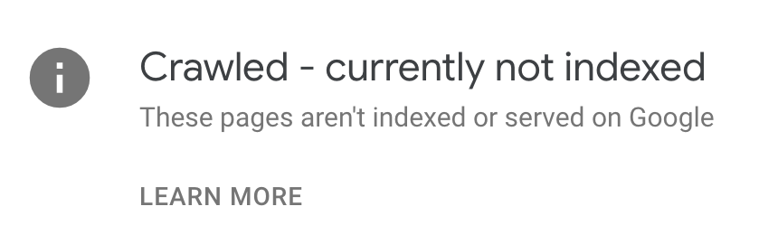

When inspecting this site in Google Search Console, I noticed a lot of the content hadn't been indexed. I've been working on improving the [domain ranking](/domain-ranking-experiment) for this site, but if the new or updated pages aren't even indexed - all of that work is moot:



How do you solve this problem? It appears that Search Console would index it _eventually_, but instead, you can use a number of services to force indexing quickly.

For now, I'm using [SpeedyIndex](https://t.me/SpeedyIndexBot?start=6919593676). It's a Telegram bot that can be used to force indexing of URLs. You get 100 links for free, but then after, it's $0.0075 per link. So 100 URLs is about a dollar. I've been using it to force indexing on a few of my sites, after putting about $30 into it a few months ago. (Link is a referral link - you get 200 links for free and I'll get some kickback on any signups)

But then - classic Kristian approach: why spend $30 once when you can build an app to do it yourself, then spend $10/mo hosting it somewhere? 🤪

[simpleindex](https://github.com/kristianfreeman/simpleindex) is an open-source app I started building at the beginning of this year to handle this problem. 

It is unfinished (the UI isn't built yet), but the important part is done - given a site URL, it will grab a sitemap, find all the available pages, and make sure they are indexed. 

It's single-tenant and open-source (the above link is to GitHub), so you can take it and roll with it.

How does it work under the hood? The core loop is pretty simple - you can call the Google [Indexing API](https://developers.google.com/search/apis/indexing-api/v3/quickstart) to notify Google that a URL has changed. Here's how I implemented it in Ruby:

```ruby
require 'google/apis/indexing_v3'

class IndexPageJob
  include Sidekiq::Job
  sidekiq_options concurrency: 1

  def perform(id)
    credentials = Google::Auth::ServiceAccountCredentials.make_creds(
      json_key_io: File.open(
        Rails.root.join("config/google-cloud.json")
      ),
      scope: "https://www.googleapis.com/auth/indexing"
    )

    page = Page.find(id)

    index = Google::Apis::IndexingV3::IndexingService.new
    index.authorization = credentials
    index.publish_url_notification(
      Google::Apis::IndexingV3::UrlNotification.new(
        type: "URL_UPDATED",
        url: page.url
      )
    )

    page.indexed = true
    page.last_scanned = DateTime.now
    page.save
  end
end
```

It's a little frustrating that you have to do all of this manually, but it's the only way to reliably make sure all pages on your site are getting indexed. Particularly at scale - if you were doing programatic SEO for instance - knowing that all your stuff is getting indexed is incredibly valuable.
