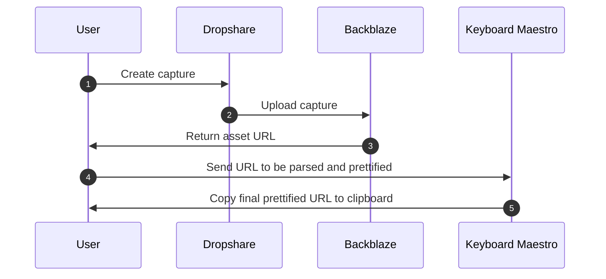
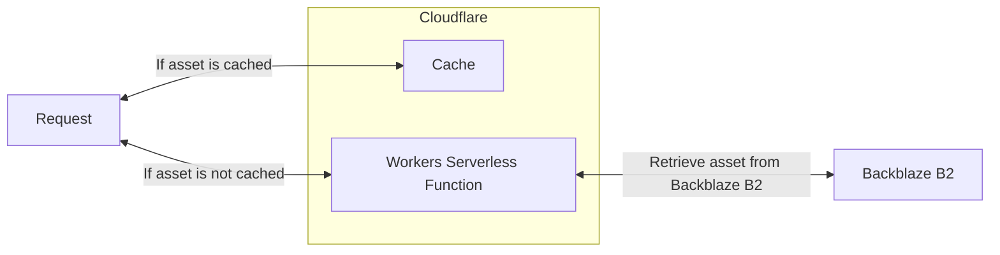

One of my favorite tools on Windows computers is [ShareX](https://getsharex.com), an open-source screenshot capture, edit, and upload tool. ShareX is really customizable, and has a great set of workflows for capturing screenshots, screencasts, and editing them.

I don't use many of those features -- generally, I use something very similar to macOS's screenshot workflow (Command + Option + 3 for full-screen screenshots, Command + Option + 4 for selection-based screenshots). But when it comes to _sharing_ ShareX captures, I've been a big fan of [James Ross' workflow](https://jross.me/free-personal-image-hosting-with-backblaze-b2-and-cloudflare-workers/) for uploading those images to Backblaze B2, and using Cloudflare Workers to cache and serve those from a clean custom URL.

As I prep for moving into a new house (and staying in an Airbnb temporarily over the next few months), I'm getting ready to put my desktop PC away in a box, and go full-time back on my personal and work MacBook Pros for daily work. That means that my ShareX workflow -- since ShareX isn't on macOS -- needs a Mac alternative.

In short, what I'm looking for is the following workflow:

1. Capture a screenshot, either full-screen or a selection
2. Upload that screenshot to Backblaze B2
3. Copy a short URL to my clipboard that can be hotlinked in chat, email, etc.

The end result of this workflow will be simple URLs on a custom domain -- below, I use the kinda silly `kmf.lol` domain I purchased last year. You'll notice that the URL structure is randomized, in the format `https://kmf.lol/<random-characters>.png`, e.g. `https://kmf.lol/MA2gNXiQ.png`:

In this blog post, I'll outline how I built that solution. A caveat: unlike Windows, I couldn't find an open-source solution to this problem. There is probably one out there, especially if you're willing to code it yourself. I'm very bought into the macOS ecosystem so I did the best I could with a number of old and new apps, which I'll detail in the Requirements section below. Looking at the overall result... it may have been easier to code it myself, but it was a fun exercise in workflow-building, regardless.

It is worth stating that James' instructions still remains a core piece of this workflow. The Workers component outlined in [his blog post](https://jross.me/free-personal-image-hosting-with-backblaze-b2-and-cloudflare-workers/), where a serverless function routes requests from a custom domain to a Backblaze B2 bucket, is still rock-solid and a prerequisite to implementing the rest of this workflow.

## Requirements

- [Dropshare](https://dropshare.app) -- a screenshot and uploading tool
- A configured Backblaze B2 bucket, per [this blog post](https://jross.me/free-personal-image-hosting-with-backblaze-b2-and-cloudflare-workers/)
- (optional, but recommended) [Keyboard Maestro](https://www.keyboardmaestro.com) -- the secret sauce for creating cleaner URLs

In my workflow, these three pieces combine to recreate a very similar workflow to my previous ShareX solution. While Dropshare in particular isn't as feature complete as ShareX, there are opportunities to plug in other tools if you need things like image editing (like Pixelmator), and Keyboard Maestro is versatile enough that you can do all sorts of things with your new capture URLs, as I'll share soon.

Before we proceed with the integration steps, here's a quick diagram of how it all fits together:

**Creating captures and uploading them:**

**Retrieving capture based on a URL and returning it as a response:**

## Configuring Dropshare

Dropshare ([link](https://dropshare.app)) will handle our capture workflow. At $25, it's not super cheap, but it works for my purposes and it's what we'll use for this integration.

After installing Dropshare, the main bit of configuration we'll do is connecting the Backblaze B2 bucket. As seen below, this config is _very_ similar to what you'll find in the original James Ross tutorial:

The addition of **Domain Alias** is an important step in getting us _most of the way there_ with our custom domain integration. As I'll show later, it doesn't produce _perfect_ URLs, but it gets us very close.

Next, we'll set keyboard shortcuts. I use the very clutch "Hyper" key mapped to Caps Lock[^1], and use that to capture my screen (Hyper + 3), a selection/window (Hyper + 4), or capture + annotate (Hyper + 5). Dropshare's annotation tools are serviceable (see an example with an annotated arrow below), but definitely aren't comparable to ShareX.

[^1]: This Hyper key config has been outlined a few places online -- [Brett Terpstra's guide](https://brettterpstra.com/2017/06/15/a-hyper-key-with-karabiner-elements-full-instructions/) is the most memorable, though it may be out of date. I'm considering doing my own guide on it, though my set up is not particularly interesting or different than the standard implementation

Finally, for my use-case, I customized Dropshare's upload functionality to generate random URLs. This is optional. In the **Uploads** tab, I chose _Randomize_ for the **Randomize filenames** option (others exist, like _Timestamp_, _Mnemonic_, and suffix-based variations), and clicked the gear icon to customize the number of randomized characters. Eight characters (e.g. `kmf.lol/abcdefgh`) seems like an acceptable amount of randomization for my use-case.

## Configuring Keyboard Maestro

At this point, you'll be able to capture screenshots and upload them to Backblaze B2. You can test this by capturing a screenshot and waiting for the upload to complete. By default, you'll see an upload in the following format: `https://<custom-domain>/<bucket-name>/<capture-asset-url>`. If your Workers function is correctly configured as discussed in the Prerequisites, this could be an acceptable stopping point. By default, the Workers function will handle URLs _with_ the bucket name (for instance, mine is `sharex-uploads`), but it's also capable of referencing the bucket _without_ it being in the URL. In all the examples I've shown in this blog post, you'll notice the structure is `https://<custom-domain>/<capture-asset-url>`, so as a final step, we can programatically remove the bucket name when we see a new, matching URL hit our clipboard, and re-capture it as the simpler, "prettifed" URL.

I've recently become obsessed with Keyboard Maestro, as an incredible tool for doing all sorts of automation fun on macOS. Even with my propensity to reach for Keyboard Maestro right now as a solution for _everything_, I wasn't sure if KM would be a good fit for this use-case.

It turns out (of course) that it is, thanks to the **System Clipboard Changed** trigger. This allows you to execute Keyboard Maestro macros when you receive new things in the clipboard. With that in mind, our macro should do something like the following:

1. When the system clipboard changes...
2. Check for a URL that looks a capture URL, returned from Backblaze B2
3. Rewrite the URL to remove the _Bucket Name_
4. Set that new, "prettified" URL on the clipboard

This macro, in actual Keyboard Maestro terms, is pretty simple. You can see a version of it below, extrapolated for sharing (so you can plug in your own **CustomDomain** and **BucketName** variables):

[Click here to download "Prettify-Dropshare-URL.kmmacros"](https://kmf.lol/7QKGVD6r.kmmacros)

## Conclusion

With that, we have a fully-featured workflow for capturing and uploading assets to Backblaze B2, using Dropshare and Keyboard Maestro. It isn't perfect: for instance, it doesn't do any sort of image compression. Plugging this into [ImageOptim](https://imageoptim.com) would be great, although there are some interesting solutions that we could integrate into our [serverless function](https://developers.cloudflare.com/images/image-resizing/resize-with-workers/) to allow automatic resizing on Cloudflare's network before the captures even are displayed to viewers.

Most impressive in all of this (to me) is Keyboard Maestro. I bought KM a while ago on a whim, reading various Mac blogs, and seeing workflows that I thought were compelling, but not killer use-cases that made the app a must buy. Instead, as I _actually_ integrate it into my day-to-day life, I'm discovering that KM might be one of those apps that really requires you to dig into it yourself. I have a very different day-to-day than a blogger, so it's hard to look at other people's workflows and say "Yes, KM would be a good fit for me, too". This capture asset workflow is actually something I find genuinely useful, and has made KM a worthwhile buy (along with some other interesting integrations I've recently done that I'll write about _#soon_).
